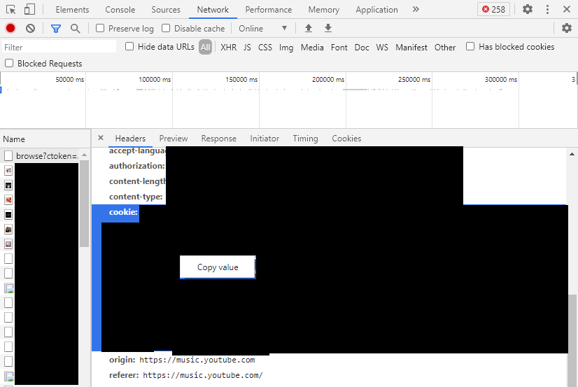

# Last.fm<n/> Youtube Music playlist

Scrapes your personal recommendations from Last.fm<n/> and creates a Youtube Music playlist. Will clear and repopulate the playlist, built to run as a daily cron.

## Prerequisites

[Node.js](https://nodejs.org/en/)

## Installation
- Download or clone this repo.
- In the base directory create a file named `.env` This file should contain a three lines.

```
YOUTUBE_COOKIE_STRING=
LASTFM_COOKIE_STRING=
PLAYLIST_NAME=Last.fm
```

- To grab your Youtube Music cookie string visit [Youtube Music](https://music.youtube.com/) and open the developer console with f12. Select the Network tab and refresh the page. Select the entry that starts with `browse?ctoken...` from the Request Headers right click on the content of the cookie value to copy it.

- Repeat the same process for your [Last.fm](https://www.last.fm/home) cookie string, it will be in the request header of the `home` entry.
- You can set PLAYLIST_NAME to anything, be aware that if you have an existing playlist with this name all tracks will be wiped and replaced.

## Usage
- Initial setup, run these commands once.
```
npm install
npm build
```
- To update your playlist
```
npm run
```

## Built With
- [youtube-music-ts-api](https://github.com/nickp10/youtube-music-ts-api)
- [Cheerio](https://www.npmjs.com/package/cheerio)